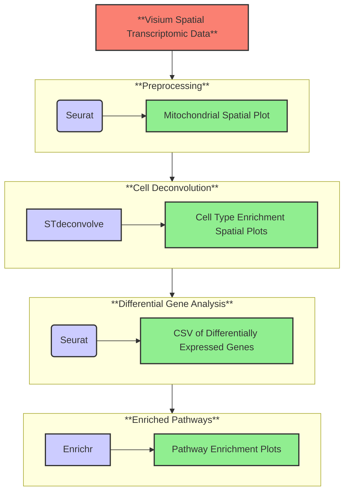
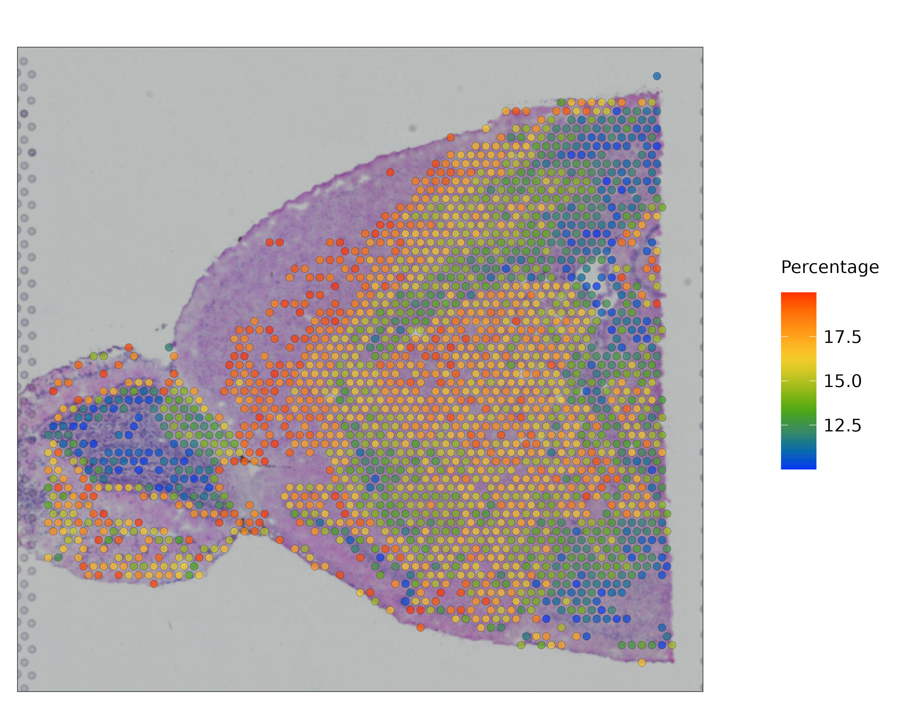
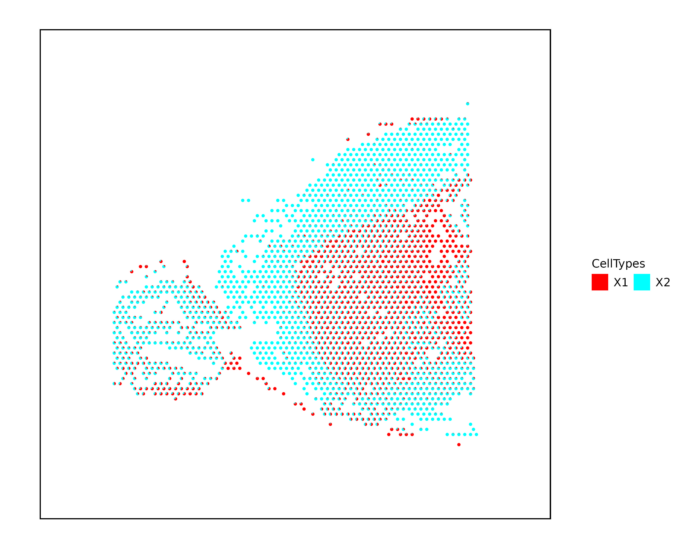
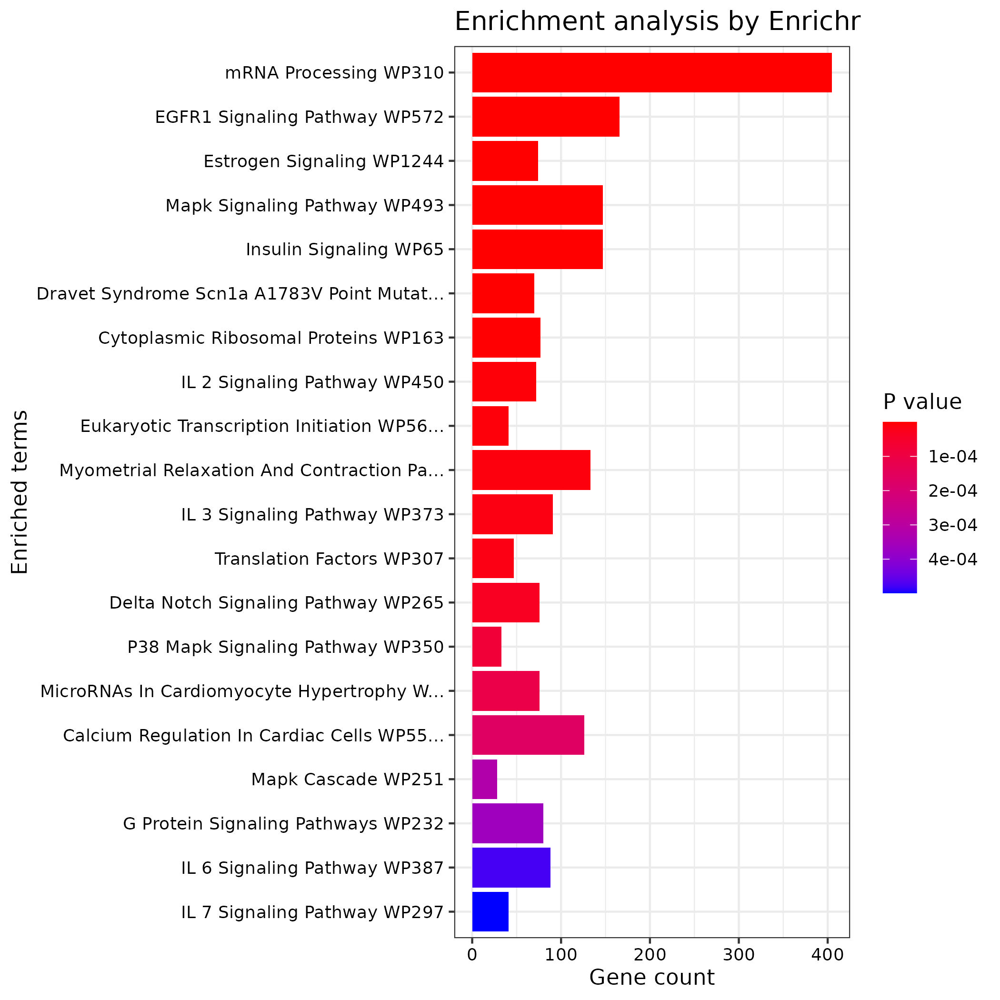

# SOP Template (replace with name of pipeline here)

Author: Samuel Leung

## Table of Contents:
1. [Background](#1-background)
1. [Workflow Overview](#2-workflow-overview)
1. [Installation and Usage](#3-installation-and-usage)
1. [References](#4-references)


## 1) Background

RNA sequencing (RNA-seq) is a powerful tool that characterizes gene expression by quantifying transcripts within a given sample [[1](#4-references)]. One of the first methods of performing RNA-seq is with bulk sequencing, where gene expression levels across all genes in a given sample are averaged, but cellular context for these genes are lost. In recent years, developments in RNA-seq technology has allowed for increased resolution of gene expression measurements at the single cell level [[2](#4-references)], overcoming limitations presented from bulk-sequncing. Single-cell RNA-seq provides an abundance of information regarding the composition of cell types and functions within complex tissue, but is lacking in terms of retaining the spatial context of identified cells. The location of a cell could provide crucial information in determining phenotype, cell state, and function. Spatial transcriptomics [[3](#4-references)], a recent development in the RNA-seq field, fills this gap in knowledge by mapping gene expression to specific locations within a tissue sample. When combined with tools like cell devonvolution [[4](#4-references)] and pathway enrichment analysis [[5](#4-references)], 
information regarding cell organization and regional transcriptional activity can be inferrered.   

The aim of my pipeline is to provide a user-friendly tool for researchers unfamiliar with computational techniques in bioinformatics to perform exploratory data analysis on spatial transcriptomic data. There are many different computational tools to analyze and explore spatial transcriptomic data, and learning to use these various tools can be daunting.
My project allows users to start gathering information from their data without the need for prior experience with bioinformatics tools. This pipeline is not meant to give comprehensive knowledge to the user, but rather serve as a way to gain preliminary information of their sample, allowing users to gain insight on how to investigate their research question further.


## 2) Workflow Overview

This pipeline takes in Visium transcriptomic data as input. Please refer to the [quickstart](#31-quickstart) section to learn about how this data should be formatted.

 An overview of the steps of this pipeline are as follows:

1. **Data Preprocessing** - Filter out poor RNA-quality regions
- This step uses the [Seurat](https://github.com/satijalab/seurat) package to load in Visium data [[6](#4-references)]
- Regions are defined to be of low quality if a large amount of mitochondrial contamination is present. If the capture spot has over 20% of reads mapping to mitochondrial counts, the capture spot is excluded from further downstream analysis. This exclusion threshold can be modified (please see the [input](#32-input) section below).
- The preprocessing step produces a SpatialPlot displaying the distribution of mitochondrial content across the sample, with low quality capture spots removed
2. **Cell Deconvolution** - Identify distribution of cell enrichment across sample 
- This step uses reference-free cell-type deconvolution from the [STdeconvolve](https://github.com/JEFworks-Lab/STdeconvolve) package [[7](#4-references)].
- Each capture spot within a visium slide is large enough to encapsulate 0-10 cells. By default, this step estimates up to 5 different cell types per spot (and their proportion), but the user can modify this parameter(see [usage](#3-installation-and-usage) section for a more detailed description).   

    - <span style="color:red">NOTE:</span> When running on test data (found in the `visium_data` folder), the maximum number of cell types this step estimates is 2.

- For every integer *K* between 2 and the maximum number of cells types, STdeconvolve will fit an LDA model [[8](#4-references)] that differentiates between *K* different cell types. Each model will be evaluated by a balance **(1)** uncertainty of predictions and **(2)** number of rare cell types detected. More details can be found from the STdeconvolve tutorial found [here](https://github.com/JEFworks-Lab/STdeconvolve/blob/devel/docs/additional_features.md).

- The deconvolution step produces a SpatialPlot, with each capture spot displayed as a piechart of cell type proportions (see the `expected_results/cell_deconvolution` folder for an example).

3. **Differential Gene Analysis** - Determine differentially expressed genes (DEGs) from most abundant cells 
- This step uses the *FindMarkers* function in Seurat [[6](#4-references)] to identify DEGs between the two most abundant cell types present
- From cell deconvolution, each capture spot will have a mix of cell types within it. In this step, capture spots are labeled as being enriched in only one cell type (the most abundant one present in that capture spot). 
- Across the entire sample, cell types are ranked based on how many capture spots are labelled for a specific cell type enrichment. The two most enriched cell types, and their corresponding capture spots, are used for downstream analysis
- Between the two groups identified using this approach, statistical significance for differences in counts for each gene present is done with a Negative Binomial test. To account for the multiple testing problem, Bonferroni Correction is used to calculate adjusted P-values. Genes with adjusted P-values lower than the threshould (default 0.05) are flagged as statistically significant, and are passed onto Enrichr in the next step.
- This step produces a list of DEGs, in CSV format

4. **Pathway Analysis** - Find enriched biological pathways 
- This step uses the [enrichR](https://github.com/wjawaid/enrichR) package to access the Enrichr database [[9](#4-references)]
    - <span style="color:red">NOTE:</span> An internet connection is required for this step to run properly
- So far, this step only works for **human** and **mouse** samples.
- DEGs from the previous step are inputted into all applicable database. For example, if working with mouse samples, all available databases regarding mouse genes will be used to determine enriched pathways. 
- For each database used, this step returns the top *n* most statistically-significant enriched pathways, where *n* is the maximum number of pathways to show. The default value for this is 20, but can be defined by the user (see [input](#32-input) section).

A visual of the workflow can be found below:


### 2.1 Software Package Versions

___

The package versions for core software packages used can be found in the drop-downs below:

<details>
    <summary>Click here to view R package versions:</summary>

```r
# Format is [package] - [version]
enrichR - v3.2
STdeconvolve - v1.3.2
here - v1.0.1
forcats - v0.5.1
stringr - v1.5.1
dplyr - v1.1.4
purrr - v1.0.2
readr - v2.0.0
tidyr - v1.3.1
tibble - v3.2.1
ggplot2 - v3.5.1
tidyverse - v1.3.1
Seurat - v5.0.1
SeuratObject - v5.0.1
sp - v2.1-4
```

</details>

<details>
    <summary>Click here to see core package versions for softwares not in R:</summary>

```bash
TODO
git - ...
docker - ...
nextflow - ...
```
</details>

## 3) Installation and Usage

### 3.1) Quickstart
This pipeline requires [git](https://git-scm.com/downloads), [docker](https://docs.docker.com/engine/install/), and [nextflow](https://www.nextflow.io/docs/latest/install.html). Specific versions of these packages used to compile this project can be found in the [package versions](#21-software-package-versions) section.

- <span style="color:red">NOTE:</span> Also make sure you have an internet connection so that the pipeline can access the necessary databases for gene enrichment analysis. 

Download this project (with HTTPS) for use with the following command:
```bash
git clone https://github.com/sleung124/BIOF501A-Project.git
cd BIOF501A-Project/
```

This pipeline has test data for you to run as an example (test data collected from [10X Genomics](https://www.10xgenomics.com/) and can be found [here](https://www.10xgenomics.com/datasets/mouse-brain-serial-section-2-sagittal-anterior-1-standard))
To run this pipeline with test data (found in `visium_data` folder), run the following:
```Bash
nextflow run main.nf -profile docker,test
```

### 3.2) Input

This pipeline runs specifically for [V1 Visium](https://www.10xgenomics.com/support/software/space-ranger/latest/getting-started/space-ranger-glossary) data, and only for **human** and **mouse** samples. If you want to use your own data, ensure that the data is in a subdirectory of wherever this pipeline is cloned to. 

<details>
    <summary>Click to view how Visium data should be structured:</summary>

```bash
ROOT/
└── visium_data/
    ├── raw_feature_bc_matrix.h5       
    ├── filtered_feature_bc_matrix.h5
    └── spatial/
        ├── aligned_fiducials.jpg
        ├── detected_tissue_image.jpg
        ├── scalefactors_json.json
        ├── spatial_enrichment.csv
        ├── tissue_hires_image.png
        ├── tissue_lowres_image.png
        └── tissue_positions.csv
```

</details></br>

To run with your own data, run:
```Bash
nextflow run main.nf -profile docker --preprocess.PATH_TO_SAMPLE your/path/to/data
```

Parameters for the workflow are separated by the different components that make up the pipeline (`preprocess`, `cell_deconvolution`, `degs`, and `pathways`). To use these parameters, choose one of the following options below, and specify a value. 

<details>
    <summary>Click to view an example of the syntax</summary>

```Bash
nextflow run main.nf -profile docker \
        --preprocess.YOUR_CHOICE_OF_PREPROCESS_PARAM your_preprocess_param \
        --degs.YOUR_CHOICE_OF_DEGS_PARAM your_deg_param \
```

</details></br>

Possible parameters for the user to define are as follows:

**Preprocess Step**:
- `--preprocess.PATH_TO_SAMPLE`: If you're using your own data, input the (relative) path to the folder containing visium data sample. See above for an example of how your data should be structured within the folder. 
- `--preprocess.FILTERED_FEATURE_H5`: Name of H5 file containing the gene-barcode matrix from detected cellular barcodes. Default name is `filtered_feature_bc_matrix.h5`.
- `--preprocess.MITO_THRESHOLD`: Percentage threshold for labelling a capture spot as low quality (capture spots with mitochondrial counts greater than this threshold are excluded from the rest of the workflow). Should input a number between 0 to 100. Default value is 20.

**Cell Deconvolution Step**:
- `--cell_deconvolution.MAX_LDA_K`: Maximum number of cell types to estimate. Should input a whole number greater than 2. STDeconvolve will fit a range of LDA models from 2 to `MAX_LDA_K`, and choose which model is optimal. More details can be found from the following [STdeconvolve tutorial](https://github.com/JEFworks-Lab/STdeconvolve/blob/devel/docs/additional_features.md)
- `--cell_deconvolution.RADIUS`: Size of piechart for each capture spot. The larger the number the bigger the pie chart. Should input a non-negative number. Default radius is 2.

**Differential Gene Analysis Step**:
- `--degs.QUICK_SAMPLE`: Samples a subset of capture spots to use to identify differentially expressed genes. Should input a whole number. Default value is 0. Mainly used to speed up run time for test example.
- `--degs.SET_SEED`: Only relevant for when `--degs.QUICK_SAMPLE` is non-zero. Sets the seed for sampling capture spots, for ensuring reproducibility when running test case. Default value is 0. **This parameter does nothing when set at 0**.  
- `--degs.PVAL_THRESH`: Threshold to determine if a gene is statistically significant. Compared against adjusted p-values after Bonferroni adjustment. Should input a number between 0 and 1. Default is 0.05

**Enriched Pathways Step**:
- `--pathways.SHOW_TERMS`: Maximum number of enriched pathways to show in plots after running this step. Should enter a whole number as input. Default value is 20. 
- `--pathways.NUMCHAR`: Pathway names are long, and can be truncated in the enriched pathways plot. This parameter controls how many characters of the pathway name is shown. Should input a whole number. Default value is 40. 
- `--pathways.ORDER_BY`: Indicates how to order enriched pathways found in the plot. Should be one of `P.value` or `Combined.Score` [[9]](#4-references). Default value is `P.value`.
- `--pathways.SPECIES`: Species of sample. For now, pipeline only supports **human** and **mouse** samples. Should be one of `Human` or `Mouse`. Default value is `Mouse`.


### 3.3) Output
<!-- - Describe the format of the output including files and visualizations. Treat this section like the results of
a paper. You can look at readthedocs pages of popular bioinformatics tools to get inspired for this. -->

Assuming that all steps run to completion, the output will be in the `results` folder, with a file structure as shown below. The `pathways` step outputs a variable amount of images depending on how many databases are used.

```bash
results/
├── cell_deconvolution/
│   └── deconvolution.jpg
├── degs/
│   └── degs.csv
├── pathways/
│   ├── <database_1_pathways>.jpg
│   ├── <database_2_pathways>.jpg
│   ├── ...
│   └── <database_n_pathways>.jpg
└── preprocess_data/
    └── mitoplot.jpg
```


<details>
    <summary>Click to view folder structure after running on test data:</summary>

```bash
expected_results/
├── cell_deconvolution/
│   └── deconvolution.jpg
├── degs/
│   └── degs.csv
├── pathways/
│   ├── HDSigDB_Mouse_2021_pathways.jpg
│   ├── KEGG_2019_Mouse_pathways.jpg
│   ├── KOMP2_Mouse_Phenotypes_2022_pathways.jpg
│   ├── Mouse_Gene_Atlas_pathways.jpg
│   ├──RNAseq_Automatic_GEO_Signatures_Mouse_Down_pathways.jpg
│   ├── RNAseq_Automatic_GEO_Signatures_Mouse_Up_pathways.jpg
│   ├── WikiPathways_2019_Mouse_pathways.jpg
│   └── WikiPathways_2024_Mouse_pathways.jpg
└── preprocess_data/
    └── mitoplot.jpg
```

</details></br>

The `preprocess_data` folder should contain the JPEG file `mitoplot.jpg`, which removes capture spots of high mitochondrial count and overlays the remaining spots on the sample's image. The remaining spots are also coloured by mitochondrial percentage. Below is the `mitoplot.jpg` generated from test data, also found in the `expected_results` directory:

<figure>
    
</figure>

The `cell_deconvolution` folder will contain the JPEG file `deconvolution.jpg`, which displays the distribution of cell types within each capture spot with a pie chart. Below is an example of this plot generated from test data, also found in the `expected_results` directory:

<figure>
    
</figure>

The `find_degs` folder will contain a CSV file where each row represents a gene, and has the following column information:
- `p_val`: Unadjusted P-value
- `avg_log2FC`: Log fold-change between the two groups. Positive values indicate higher gene expression in the first group (the group with highest cell abundance).
- `pct.1`: Percentage of capture spots where the gene is detected in the first group 
- `pct.2`: Same as `pct.1`, but for the second group. 
- `p_val_adj`: Adjusted P-value by Bonferroni Correction, based on all genes present. 

The following is the expected CSV output from test data:

|FIELD1|p_val                |avg_log2FC      |pct.1|pct.2|p_val_adj            |
|------|---------------------|----------------|-----|-----|---------------------|
|Gnas  |3.00401197416407e-158|1.85931826348053|1    |1    |9.69845265858871e-154|
|Olfm1 |6.18010325568972e-146|2.89058134561755|0.997|0.912|1.99524633609943e-141|
|Basp1 |1.21427149217756e-130|2.37790628689126|0.984|0.901|3.92027551249524e-126|
|Snap25|6.3468978625425e-125 |2.03939591703795|1    |0.994|2.04909597492184e-120|
|Tubb2a|2.91254513316691e-123|1.92185990507079|1    |0.956|9.40315196242937e-119|
|Sncb  |1.09910406839308e-121|2.18865984768322|0.997|0.884|3.54845748480706e-117|

The `pathways` folder will contain multiple barplots, each created from a different Enrichr database. The vertical axis are the names of enriched pathways, ordered by P-value (by default). The horizontal axis displays gene counts, and bars are coloured by P-value. The following is one such plot generated from test data, take from the `WikiPathways_2024_Mouse` database. 

<figure>
    
</figure>


### 4) References

[1] Haque, A., Engel, J., Teichmann, S.A. et al. A practical guide to single-cell RNA-sequencing for biomedical research and clinical applications. Genome Med 9, 75 (2017). https://doi.org/10.1186/s13073-017-0467-4

[2] Jovic, D., Liang, X., Zeng, H., Lin, L., Xu, F., & Luo, Y. (2022). Single-cell RNA sequencing technologies and applications: A brief overview. Clinical and translational medicine, 12(3), e694. https://doi.org/10.1002/ctm2.694

[3] Williams, C.G., Lee, H.J., Asatsuma, T. et al. An introduction to spatial transcriptomics for biomedical research. Genome Med 14, 68 (2022). https://doi.org/10.1186/s13073-022-01075-1

[4] Momeni, K., Ghorbian, S., Ahmadpour, E. et al. Unraveling the complexity: understanding the deconvolutions of RNA-seq data. transl med commun 8, 21 (2023). https://doi.org/10.1186/s41231-023-00154-8

[5] Ashburner, M., Ball, C., Blake, J. et al. Gene Ontology: tool for the unification of biology. Nat Genet 25, 25–29 (2000). https://doi.org/10.1038/75556

[6] Hao, Y., Stuart, T., Kowalski, M.H. et al. Dictionary learning for integrative, multimodal and scalable single-cell analysis. Nat Biotechnol 42, 293–304 (2024). https://doi.org/10.1038/s41587-023-01767-y

[7] Miller, B.F., Huang, F., Atta, L. et al. Reference-free cell type deconvolution of multi-cellular pixel-resolution spatially resolved transcriptomics data. Nat Commun 13, 2339 (2022). https://doi.org/10.1038/s41467-022-30033-z

[8] Jelodar, H., Wang, Y., Yuan, C., & Feng, X. (2017). Latent Dirichlet Allocation (LDA) and topic modeling: Models, applications, a survey. CoRR, abs/1711.04305. https://arxiv.org/abs/1711.04305

[9] Kuleshov, M. V., Jones, M. R., Rouillard, A. D., Fernandez, N. F., Duan, Q., Wang, Z., Koplev, S., Jenkins, S. L., Jagodnik, K. M., Lachmann, A., McDermott, M. G., Monteiro, C. D., Gundersen, G. W., & Ma'ayan, A. (2016). Enrichr: a comprehensive gene set enrichment analysis web server 2016 update. Nucleic acids research, 44(W1), W90–W97. https://doi.org/10.1093/nar/gkw377
___


// ### (EXTRA) Repository Structure

<details>
  <summary>Open to see Repository Structure</summary>

```bash
ROOT/
├── Dockerfile
├── Makefile
├── README.md
├── bin/
│   ├── cell_deconvolution.r
│   ├── find_degs.r
│   ├── pathways.r
│   └── preprocess.r
├── expected_results/
│   ├── cell_deconvolution/
│   │   └── deconvolution.jpg
│   ├── degs/
│   │   └── degs.csv
│   ├── pathways/
│   │   ├── HDSigDB_Mouse_2021_pathways.jpg
│   │   ├── KEGG_2019_Mouse_pathways.jpg
│   │   ├── KOMP2_Mouse_Phenotypes_2022_pathways.jpg
│   │   ├── Mouse_Gene_Atlas_pathways.jpg
│   │   ├──RNAseq_Automatic_GEO_Signatures_Mouse_Down_pathways.jpg
│   │   ├── RNAseq_Automatic_GEO_Signatures_Mouse_Up_pathways.jpg
│   │   ├── WikiPathways_2019_Mouse_pathways.jpg
│   │   └── WikiPathways_2024_Mouse_pathways.jpg
│   └── preprocess_data/
│       └── mitoplot.jpg
├── installs/
│   └── install_r_packages.r
├── main.nf/
├── modules/
│   ├── cell_deconvolution/
│   │   └── main.nf
│   ├── differential_expression/
│   │   └── main.nf
│   ├── pathway_analysis/
│   │   └── main.nf
│   └── preprocess/
│       └── main.nf
├── nextflow.config
└── visium_data/
    ├── raw_feature_bc_matrix.h5       
    ├── filtered_feature_bc_matrix.h5
    └── spatial/
        ├── aligned_fiducials.jpg
        ├── detected_tissue_image.jpg
        ├── scalefactors_json.json
        ├── spatial_enrichment.csv
        ├── tissue_hires_image.png
        ├── tissue_lowres_image.png
        └── tissue_positions.csv
```

</details>