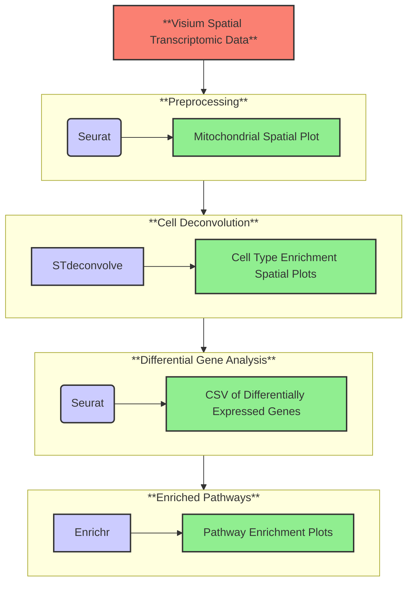

# SOP Template (replace with name of pipeline here)

### TODOS:

___

- Finish SOP
- Add volcano plot functionality given enough time


## Quickstart:
To run this pipeline with [test data](https://www.10xgenomics.com/datasets/mouse-brain-serial-section-2-sagittal-anterior-1-standard) (found in `visium_data` folder), run the following:
```Bash
nextflow run main.nf -profile docker,test
```

To run with your own data, run:
```Bash
nextflow run main.nf -profile docker --preprocess.PATH_TO_SAMPLE your/path/to/data
```

This pipeline runs specifically for [V1 Visium](https://www.10xgenomics.com/support/software/space-ranger/latest/getting-started/space-ranger-glossary) data. If you want to use your own data, ensure that the data is in a subdirectory of wherever this pipeline is cloned to. Visium data should have the following file structure, with at minimum these files: 

```Bash
└── data/
    ├── filtered_feature_bc_matrix.h5
    └── spatial/
        ├── aligned_fiducials.jpg
        ├── detected_tissue_image.jpg
        ├── scalefactors_json.json
        ├── spatial_enrichment.csv
        ├── tissue_hires_image.png
        ├── tissue_lowres_image.png
        └── tissue_positions.csv
```

## Table of Contents:
1. [Background](#1-background)
1. [Workflow Overview]()
1. [Installation and Usage](#3-installation-and-usage)
1. [References](#4-references)


### 1) Background
___

RNA sequencing (RNA-seq) is a powerful tool that characterizes gene expression by quantifying transcripts within a given sample[**cite generic rna seq paper here**]. One of the first methods of performing RNA-seq is with bulk sequencing, where gene expression levels across all genes in a given sample are averaged, but cellular context for these genes are lost. In recent years, developments in RNA-seq technology has allowed for increased resolution of gene expression measurements at the single cell level[**cite single cell paper here**], overcoming limitations presented from bulk-sequncing. However, this method does not account for the spatial context of cells identified. Spatial transcriptomics is a recent development in the RNA-seq field which maps gene expression within the context of tissue architecture, providing information on how cells are organized within the tissue and uncovering differences in molecular activity across varying cell-enriched areas.

Spatial transcriptomics is useful because it allows researchers to map gene expression within the context of tissue architecture, providing insights into the spatial organization of cells and revealing how molecular activity varies across different regions of a tissue or organ.

- Include the what's and why's, as well as aims
- Include package dependencies that are required (bullet points OK)

    - include the what’s and why’s; also your aims
    - include any package dependencies that are required (bullet points are ok for this)
    - You can include your DAG here

### 2) Workflow Overview

___


TODO: Explain general process, as well as which libraries are related to each step


### 2.1) Core R Package Versions (dependencies)
TODO: add package versions for docker, git, nextflow
```r
# Format is [package] - [version]
enrichR - v3.2
STdeconvolve - v1.3.2
here - v1.0.1
forcats - v0.5.1
stringr - v1.5.1
dplyr - v1.1.4
purrr - v1.0.2
readr - v2.0.0
tidyr - v1.3.1
tibble - v3.2.1
ggplot2 - v3.5.1
tidyverse - v1.3.1
Seurat - v5.0.1
SeuratObject - v5.0.1
sp - v2.1-4
```

### 3) Installation and Usage
- Make sure you format everything so that step by step usage details are included. If we can’t run your pipeline then we can’t give you marks.
- including any datasets that are to be used if they are not provided
(i.e. how to download them using wget or curl – exact paths need to be specified and the data
must be accessible)

- Exact step by step usage with descriptive comments on what action is being performed in each step

#### 3.1) Input
- Describe the format of the input data, explaining **all** fields.


#### 3.2) Output
- Describe the format of the output including files and visualizations. Treat this section like the results of
a paper. You can look at readthedocs pages of popular bioinformatics tools to get inspired for this.

#### 3.3) Expected Output

<details>
    <summary>Click to view folder structure after running on test data:</summary>

```bash
expected_results/
├── cell_deconvolution/
│   └── deconvolution.jpg
├── degs/
│   └── degs.csv
├── pathways/
│   ├── HDSigDB_Mouse_2021_pathways.jpg
│   ├── KEGG_2019_Mouse_pathways.jpg
│   ├── KOMP2_Mouse_Phenotypes_2022_pathways.jpg
│   ├── Mouse_Gene_Atlas_pathways.jpg
│   ├──RNAseq_Automatic_GEO_Signatures_Mouse_Down_pathways.jpg
│   ├── RNAseq_Automatic_GEO_Signatures_Mouse_Up_pathways.jpg
│   ├── WikiPathways_2019_Mouse_pathways.jpg
│   └── WikiPathways_2024_Mouse_pathways.jpg
└── preprocess_data/
    └── mitoplot.jpg
```

</details>

### 4) References

___

TODO: Populate with references

### (EXTRA) Repository Structure

<details>
  <summary>Open to see Repository Structure</summary>

```bash
ROOT/
├── Dockerfile
├── Makefile
├── README.md
├── bin/
│   ├── cell_deconvolution.r
│   ├── find_degs.r
│   ├── pathways.r
│   └── preprocess.r
├── expected_results/
│   ├── cell_deconvolution/
│   │   └── deconvolution.jpg
│   ├── degs/
│   │   └── degs.csv
│   ├── pathways/
│   │   ├── HDSigDB_Mouse_2021_pathways.jpg
│   │   ├── KEGG_2019_Mouse_pathways.jpg
│   │   ├── KOMP2_Mouse_Phenotypes_2022_pathways.jpg
│   │   ├── Mouse_Gene_Atlas_pathways.jpg
│   │   ├──RNAseq_Automatic_GEO_Signatures_Mouse_Down_pathways.jpg
│   │   ├── RNAseq_Automatic_GEO_Signatures_Mouse_Up_pathways.jpg
│   │   ├── WikiPathways_2019_Mouse_pathways.jpg
│   │   └── WikiPathways_2024_Mouse_pathways.jpg
│   └── preprocess_data/
│       └── mitoplot.jpg
├── installs/
│   └── install_r_packages.r
├── main.nf/
├── modules/
│   ├── cell_deconvolution/
│   │   └── main.nf
│   ├── differential_expression/
│   │   └── main.nf
│   ├── pathway_analysis/
│   │   └── main.nf
│   └── preprocess/
│       └── main.nf
├── nextflow.config
└── visium_data/
    ├── raw_feature_bc_matrix.h5       
    ├── filtered_feature_bc_matrix.h5
    └── spatial/
        ├── aligned_fiducials.jpg
        ├── detected_tissue_image.jpg
        ├── scalefactors_json.json
        ├── spatial_enrichment.csv
        ├── tissue_hires_image.png
        ├── tissue_lowres_image.png
        └── tissue_positions.csv
```

</details>