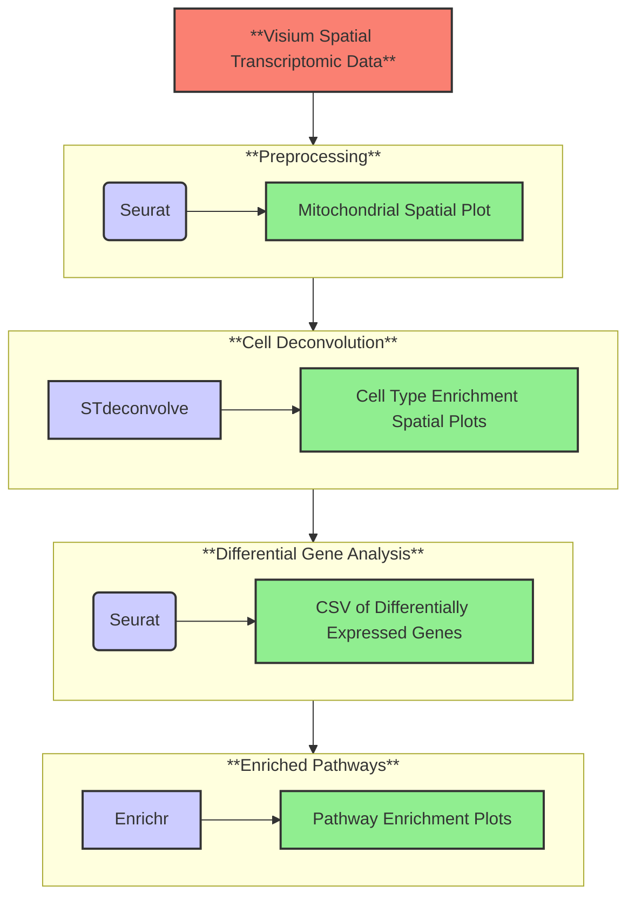

# SOP Template (replace with name of pipeline here)

Author: Samuel Leung

## Quickstart:
This pipeline requires [git](https://git-scm.com/downloads), [docker](https://docs.docker.com/engine/install/), and [nextflow](https://www.nextflow.io/docs/latest/install.html). Specific versions of these packages used to compile this project can be found in the [installations and usage](#3-installation-and-usage) section.

Download this project (with HTTPS) for use with the following command:
```bash
git clone https://github.com/sleung124/BIOF501A-Project.git
```

To run this pipeline with [test data](https://www.10xgenomics.com/datasets/mouse-brain-serial-section-2-sagittal-anterior-1-standard) (found in `visium_data` folder), run the following:
```Bash
nextflow run main.nf -profile docker,test
```

To run with your own data, run:
```Bash
nextflow run main.nf -profile docker --preprocess.PATH_TO_SAMPLE your/path/to/data
```

This pipeline runs specifically for [V1 Visium](https://www.10xgenomics.com/support/software/space-ranger/latest/getting-started/space-ranger-glossary) data. If you want to use your own data, ensure that the data is in a subdirectory of wherever this pipeline is cloned to. 

<details>
    <summary>Click to view how Visium data should be structured:</summary>

```Bash
└── data/
    ├── filtered_feature_bc_matrix.h5
    └── spatial/
        ├── aligned_fiducials.jpg
        ├── detected_tissue_image.jpg
        ├── scalefactors_json.json
        ├── spatial_enrichment.csv
        ├── tissue_hires_image.png
        ├── tissue_lowres_image.png
        └── tissue_positions.csv
```
</details>

## Table of Contents:
1. [Background](#1-background)
1. [Workflow Overview](#2-workflow-overview)
1. [Installation and Usage](#3-installation-and-usage)
1. [References](#4-references)


### 1) Background
___

RNA sequencing (RNA-seq) is a powerful tool that characterizes gene expression by quantifying transcripts within a given sample [[1](#4-references)]. One of the first methods of performing RNA-seq is with bulk sequencing, where gene expression levels across all genes in a given sample are averaged, but cellular context for these genes are lost. In recent years, developments in RNA-seq technology has allowed for increased resolution of gene expression measurements at the single cell level [[2](#4-references)], overcoming limitations presented from bulk-sequncing. Single-cell RNA-seq provides an abundance of information regarding the composition of cell types and functions within complex tissue, but is lacking in terms of retaining the spatial context of identified cells. The location of a cell could provide crucial information in determining phenotype, cell state, and function. Spatial transcriptomics [[3](#4-references)], a recent development in the RNA-seq field, fills this gap in knowledge by mapping gene expression to specific locations within a tissue sample. When combined with tools like cell devonvolution [[4](#4-references)] and pathway enrichment analysis [[5](#4-references)], 
information regarding cell organization and regional transcriptional activity can be inferrered.   

The aim of my pipeline is to provide a user-friendly tool for researchers to perform exploratory data analysis on spatial transcriptomic data. This pipeline acts as a "first pass" for researchers to investigate their data, providing information on regions of low-quality RNA, distribution of cell enrichment, differentially expressed genes between abundant cell populations, and corresponding enriched pathways. This pipeline is not meant to give comprehensive knowledge to the user, but rather serve as an easy way to gain insight on how to properly analyze the data.


### 2) Workflow Overview

___

As stated above, this pipeline takes in Visium data as input. Please refer to the [quickstart](#quickstart) section to learn about how this data should be formatted.

 A brief overview steps of this pipeline are as follows:

1. Filter out poor RNA-quality regions (Data Preprocessing)
1. Identify distribution of cell enrichment across sample (Cell Deconvolution)
1. Determine differentially expressed genes (DEGs) from most abundant cells (Differential Gene Analysis)
1. Find enriched biological pathways (Pathway Analysis)

A visual of the workflow can be found below:



### 2.1) Packages used at each step

### 2.2) Core R Package Versions (dependencies)
TODO: add package versions for docker, git, nextflow
```r
# Format is [package] - [version]
enrichR - v3.2
STdeconvolve - v1.3.2
here - v1.0.1
forcats - v0.5.1
stringr - v1.5.1
dplyr - v1.1.4
purrr - v1.0.2
readr - v2.0.0
tidyr - v1.3.1
tibble - v3.2.1
ggplot2 - v3.5.1
tidyverse - v1.3.1
Seurat - v5.0.1
SeuratObject - v5.0.1
sp - v2.1-4
```

### 3) Installation and Usage
- Make sure you format everything so that step by step usage details are included. If we can’t run your pipeline then we can’t give you marks.
- including any datasets that are to be used if they are not provided
(i.e. how to download them using wget or curl – exact paths need to be specified and the data
must be accessible)

- Exact step by step usage with descriptive comments on what action is being performed in each step

#### 3.1) Input
- Describe the format of the input data, explaining **all** fields.


#### 3.2) Output
- Describe the format of the output including files and visualizations. Treat this section like the results of
a paper. You can look at readthedocs pages of popular bioinformatics tools to get inspired for this.

#### 3.3) Expected Output

<details>
    <summary>Click to view folder structure after running on test data:</summary>

```bash
expected_results/
├── cell_deconvolution/
│   └── deconvolution.jpg
├── degs/
│   └── degs.csv
├── pathways/
│   ├── HDSigDB_Mouse_2021_pathways.jpg
│   ├── KEGG_2019_Mouse_pathways.jpg
│   ├── KOMP2_Mouse_Phenotypes_2022_pathways.jpg
│   ├── Mouse_Gene_Atlas_pathways.jpg
│   ├──RNAseq_Automatic_GEO_Signatures_Mouse_Down_pathways.jpg
│   ├── RNAseq_Automatic_GEO_Signatures_Mouse_Up_pathways.jpg
│   ├── WikiPathways_2019_Mouse_pathways.jpg
│   └── WikiPathways_2024_Mouse_pathways.jpg
└── preprocess_data/
    └── mitoplot.jpg
```

</details>

### 4) References

[1] Haque, A., Engel, J., Teichmann, S.A. et al. A practical guide to single-cell RNA-sequencing for biomedical research and clinical applications. Genome Med 9, 75 (2017). https://doi.org/10.1186/s13073-017-0467-4

[2] Jovic, D., Liang, X., Zeng, H., Lin, L., Xu, F., & Luo, Y. (2022). Single-cell RNA sequencing technologies and applications: A brief overview. Clinical and translational medicine, 12(3), e694. https://doi.org/10.1002/ctm2.694

[3] Williams, C.G., Lee, H.J., Asatsuma, T. et al. An introduction to spatial transcriptomics for biomedical research. Genome Med 14, 68 (2022). https://doi.org/10.1186/s13073-022-01075-1

[4] Momeni, K., Ghorbian, S., Ahmadpour, E. et al. Unraveling the complexity: understanding the deconvolutions of RNA-seq data. transl med commun 8, 21 (2023). https://doi.org/10.1186/s41231-023-00154-8

[5] Ashburner, M., Ball, C., Blake, J. et al. Gene Ontology: tool for the unification of biology. Nat Genet 25, 25–29 (2000). https://doi.org/10.1038/75556
___


// ### (EXTRA) Repository Structure

<details>
  <summary>Open to see Repository Structure</summary>

```bash
ROOT/
├── Dockerfile
├── Makefile
├── README.md
├── bin/
│   ├── cell_deconvolution.r
│   ├── find_degs.r
│   ├── pathways.r
│   └── preprocess.r
├── expected_results/
│   ├── cell_deconvolution/
│   │   └── deconvolution.jpg
│   ├── degs/
│   │   └── degs.csv
│   ├── pathways/
│   │   ├── HDSigDB_Mouse_2021_pathways.jpg
│   │   ├── KEGG_2019_Mouse_pathways.jpg
│   │   ├── KOMP2_Mouse_Phenotypes_2022_pathways.jpg
│   │   ├── Mouse_Gene_Atlas_pathways.jpg
│   │   ├──RNAseq_Automatic_GEO_Signatures_Mouse_Down_pathways.jpg
│   │   ├── RNAseq_Automatic_GEO_Signatures_Mouse_Up_pathways.jpg
│   │   ├── WikiPathways_2019_Mouse_pathways.jpg
│   │   └── WikiPathways_2024_Mouse_pathways.jpg
│   └── preprocess_data/
│       └── mitoplot.jpg
├── installs/
│   └── install_r_packages.r
├── main.nf/
├── modules/
│   ├── cell_deconvolution/
│   │   └── main.nf
│   ├── differential_expression/
│   │   └── main.nf
│   ├── pathway_analysis/
│   │   └── main.nf
│   └── preprocess/
│       └── main.nf
├── nextflow.config
└── visium_data/
    ├── raw_feature_bc_matrix.h5       
    ├── filtered_feature_bc_matrix.h5
    └── spatial/
        ├── aligned_fiducials.jpg
        ├── detected_tissue_image.jpg
        ├── scalefactors_json.json
        ├── spatial_enrichment.csv
        ├── tissue_hires_image.png
        ├── tissue_lowres_image.png
        └── tissue_positions.csv
```

</details>